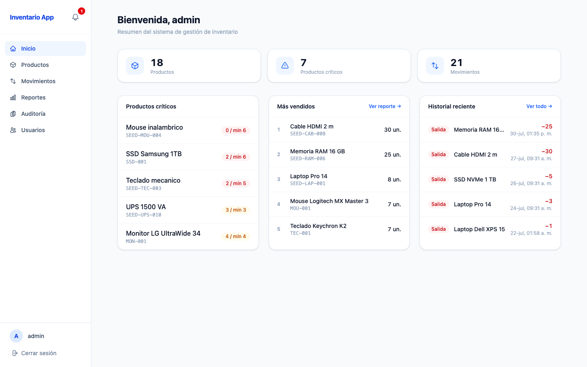

# FullStackTesting

Sistema de gestión de inventario: catálogo de productos, movimientos de stock, alertas de
stock mínimo en tiempo real, reportes, auditoría de cambios y administración de permisos.

**Stack:** Spring Boot 4 · Java 25 · PostgreSQL 17 · Keycloak 26 · React 19 · TypeScript ·
Docker Compose · GitHub Actions.



## Arranque rápido

```bash
cp .env.example .env
docker compose up -d
```

| Servicio | URL | Credenciales |
|---|---|---|
| Aplicación | http://localhost:5173 | `admin` / `admin` |
| API | http://localhost:8080 | Bearer JWT de Keycloak |
| Swagger UI | http://localhost:8080/swagger-ui.html | — |
| Keycloak | http://localhost:8081 | `admin` / `admin` |
| Grafana | http://localhost:3001 | `admin` / `admin` |

Detalle completo en la [guía de instalación](docs/03-instalacion.md).

## Pruebas

```bash
./gradlew test           # 238 casos: unitarias, integración y BDD
./gradlew securityTest   # 114 casos: JWT, permisos, CORS, cabeceras
npx playwright test      # 28 casos de extremo a extremo
```

## Documentación

| Documento | Contenido |
|---|---|
| [Requisitos](docs/01-requisitos.md) | SRS según ISO/IEC/IEEE 29148: requisitos funcionales, no funcionales y trazabilidad |
| [Arquitectura](docs/02-arquitectura.md) | arc42 + modelo C4: contexto, contenedores, componentes, despliegue y decisiones |
| [Instalación](docs/03-instalacion.md) | Puesta en marcha local y despliegue a staging y producción |
| [Mantenimiento](docs/04-mantenimiento.md) | Operación, respaldos, migraciones y runbooks |
| [Guía de pruebas](docs/05-guia-pruebas.md) | ISO/IEC/IEEE 29119-3: plan, casos e informe de cierre |
| [Anexos generados](docs/README.md#anexos-generados) | Casos de prueba, referencia de la API y esquema de base de datos |
| [Rendimiento](performance/README.md) | Suite de carga con k6 y JMeter |
