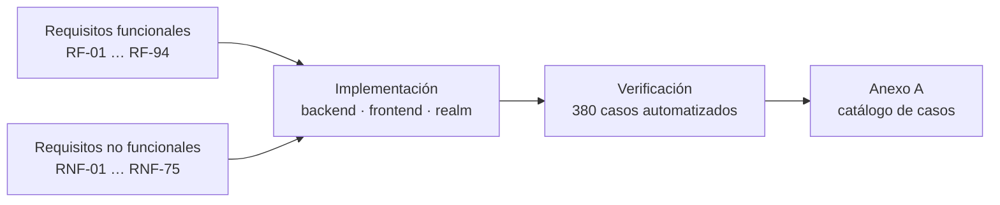

# Especificación de requisitos de software (SRS)

**Sistema de Gestión de Inventarios Empresarial** · versión 1.0 · 2026-07-29

Documento estructurado según el esquema de SRS de **ISO/IEC/IEEE 29148:2018** (cláusula 8.5.2,
sucesora de IEEE 830-1998), con el contenido exigido en su cláusula 9.6. Se aplica
*conformidad adaptada*: se conservan las secciones aplicables a un sistema de este tamaño.

Cada requisito lleva los atributos de la cláusula 5.2.8: **identificador único**, **prioridad**
y **método de verificación** con traza al caso de prueba. Cada fila se lee como
«El sistema **deberá** …». Prioridad: **A** imprescindible · **M** importante · **B** deseable.
La columna *Verificación* referencia el [Anexo A — Casos de prueba](anexo-a-casos-de-prueba.md).

---

## 1. Introducción

### 1.1 Propósito

Gestionar el inventario de una pequeña empresa: catálogo de productos, entradas y salidas de
existencia, alertas de stock mínimo, reportes operativos, historial auditable de cambios y
administración granular de permisos.

### 1.2 Alcance

Queda **fuera**: facturación, compras a proveedores, órdenes de venta, almacenes múltiples y
contabilidad. El sistema tampoco administra el ciclo de vida de las cuentas (alta, baja,
contraseñas): eso vive en Keycloak; el sistema solo asigna y retira **roles**.

### 1.3 Perspectiva del producto

Aplicación web de tres capas: SPA de React, API REST sin estado en Spring Boot y PostgreSQL
como único almacén. La identidad se delega por completo en Keycloak (OIDC) y la observabilidad
en la pila Grafana. Ver [documentación de arquitectura](02-arquitectura.md).

### 1.4 Definiciones y acrónimos

| Término | Significado |
|---|---|
| SKU | Código único que identifica un producto |
| Stock mínimo | Umbral por debajo del cual el producto se considera crítico |
| Movimiento | Entrada (`IN`), salida (`OUT`) o ajuste (`ADJUSTMENT`) de existencia |
| Permiso | Autorización granular (`product:view`, `stock:manage`, …) presente en el token |
| Rol compuesto | Agrupación de permisos que Keycloak expande al firmar el token |
| Revisión | Versión histórica de una entidad registrada por Hibernate Envers |

### 1.5 Características de los usuarios

| Actor | Rol de Keycloak | Descripción |
|---|---|---|
| Consultor | `INVENTORY_VIEWER` | Consulta inventario, movimientos y reportes |
| Operador | `INVENTORY_OPERATOR` | Crea y edita productos, registra movimientos |
| Auditor | `AUDITOR` | Consulta auditoría y reportes, sin modificar |
| Administrador | `INVENTORY_ADMIN` | Todos los permisos, incluida la gestión de roles |
| Sistema | — | Procesos internos sin usuario; se registran como `system` |

### 1.6 Limitaciones

El sistema opera sobre un solo almacén lógico y no sustituye a un ERP: no cubre facturación,
compras, ventas ni contabilidad.

---

## 2. Referencias

| Referencia | Uso |
|---|---|
| ISO/IEC/IEEE 29148:2018 | Estructura y atributos de este documento |
| ISO/IEC/IEEE 29119-3:2021 | Documentación de pruebas ([guía de pruebas](05-guia-pruebas.md)) |
| Modelo C4 (Simon Brown) | Diagramas de arquitectura ([arquitectura](02-arquitectura.md)) |
| RFC 7807 | Formato de las respuestas de error de la API |
| OpenID Connect Core 1.0 y RFC 7636 (PKCE) | Autenticación |
| OWASP Top 10 | Referencia de los requisitos de seguridad |

---

## 3. Requisitos específicos

### 3.1 Interfaces externas

| Sistema | Rol |
|---|---|
| Keycloak 26.3 | Proveedor de identidad OIDC: emite y firma los JWT, guarda usuarios y roles |
| Cloudflare | Borde público de staging y producción: TLS y túnel |
| GitHub Actions / GHCR | Integración continua, registro de imágenes y despliegue |
| Prometheus · Loki · Tempo · Grafana | Métricas, logs, trazas y tableros |

### 3.2 Funciones

Requisitos funcionales agrupados por módulo.

#### 3.2.1 Autenticación y sesión

| ID | Requisito | Prio | Verificación |
|---|---|---|---|
| RF-01 | Inicio de sesión contra Keycloak con OIDC Authorization Code + PKCE (S256); el sistema nunca recibe la contraseña | A | E2E-LOGIN-01, SEC-AUTH-01 |
| RF-02 | Toda ruta distinta de `/login` exige sesión activa | A | E2E-LOGIN-01 |
| RF-03 | La API acepta solo JWT del realm `fullstacktesting`, firmados en RS256 y con audiencia `fullstacktesting-api` | A | SEC-JWT-01 … 11 |
| RF-04 | `GET /api/auth/me` devuelve usuario, correo y roles del token | M | IT-AUTH-01 … 03 |
| RF-05 | El access token se renueva automáticamente cuando le quedan menos de 30 s | M | E2E (todas las sesiones) |
| RF-06 | Cerrar sesión invalida la sesión en Keycloak y vuelve a `/login` | M | E2E-LOGOUT-01 |
| RF-07 | La sesión sobrevive a una recarga completa del navegador | M | E2E (helper de navegación) |

#### 3.2.2 Autorización

| ID | Requisito | Prio | Verificación |
|---|---|---|---|
| RF-10 | El acceso se decide por permisos granulares, nunca por nombre de rol | A | SEC-AUTZ-01 … 03 |
| RF-11 | Los roles de negocio son compuestos y Keycloak los expande al firmar el token | A | SEC-AUTZ-03, UT-JWT-03 |
| RF-12 | Sin token responde **401**; con token válido pero sin permiso, **403** | A | BDD-SEG-01, BDD-SEG-02 |
| RF-13 | Doble barrera: por ruta en la cadena de filtros y por operación con `@PreAuthorize` | A | IT-AUTZ-01 … 15 |
| RF-14 | La interfaz oculta los controles sin permiso; la decisión real es del backend | M | E2E-STOCK-05, E2E-USERS-03 |

**Matriz de permisos por rol**

| Permiso | VIEWER | OPERATOR | AUDITOR | ADMIN |
|---|:--:|:--:|:--:|:--:|
| `product:view` | ✅ | ✅ | ✅ | ✅ |
| `product:manage` | — | ✅ | — | ✅ |
| `stock:view` | ✅ | ✅ | ✅ | ✅ |
| `stock:manage` | — | ✅ | — | ✅ |
| `report:view` | ✅ | ✅ | ✅ | ✅ |
| `audit:view` | — | — | ✅ | ✅ |
| `user:manage` | — | — | — | ✅ |

**Permiso exigido por endpoint**

| Endpoint | Permiso |
|---|---|
| `GET /api/auth/me` | autenticado |
| `GET /api/products`, `/api/products/{id}` | `product:view` |
| `POST`, `PUT`, `DELETE /api/products` | `product:manage` |
| `GET /api/stock-movements`, `/api/stock-movements/{id}` | `stock:view` |
| `POST /api/stock-movements` | `stock:manage` |
| `/api/notifications/**` | `product:view` |
| `/api/reports/**` | `report:view` |
| `/api/audit/**` | `audit:view` |
| `/api/admin/**` | `user:manage` |
| `WS /ws/notifications` | `product:view` |
| `/actuator/health`, `/actuator/prometheus`, `/v3/api-docs`, `/swagger-ui/**` | público |

#### 3.2.3 Gestión de productos

| ID | Requisito | Prio | Verificación |
|---|---|---|---|
| RF-20 | Crear producto con nombre, SKU, descripción, categoría, precio, cantidad, stock mínimo y estado; responde **201** | A | BDD-PROD-01, UT-PROD-01 |
| RF-21 | SKU único en todo el sistema; un duplicado responde **409** | A | BDD-PROD-02, UT-PROD-02, DB-INT-06 |
| RF-22 | El SKU se normaliza a mayúsculas y sin espacios extremos | M | revisión de código (`ProductService`) |
| RF-23 | Consultar producto por identificador; **404** si no existe | A | BDD-PROD-05 |
| RF-24 | Listar productos con paginación, búsqueda por nombre o SKU y filtro por estado | A | IT-PROD-06 … 08, BDD-PROD-08 |
| RF-25 | Actualizar producto conservando la unicidad del SKU | A | BDD-PROD-06, UT-PROD-04 |
| RF-26 | Eliminar producto; responde **204** | A | BDD-PROD-07, IT-PROD-05 |
| RF-27 | Orden por defecto: `createdAt`, página de 10 elementos | B | BDD-PROD-08 |

#### 3.2.4 Control de stock

| ID | Requisito | Prio | Verificación |
|---|---|---|---|
| RF-30 | Registrar movimiento `IN`, `OUT` o `ADJUSTMENT`; responde **201** | A | BDD-MOV-01 … 07 |
| RF-31 | `IN` suma, `OUT` resta y `ADJUSTMENT` fija la cantidad exacta | A | UT-MOV-01 … 03 |
| RF-32 | Una salida mayor al stock disponible responde **409** sin modificar nada | A | BDD-MOV-03, BDD-MOV-06 |
| RF-33 | El stock nunca queda negativo | A | UT-MOV-07, DB-INT-12 |
| RF-34 | Cada movimiento guarda cantidad anterior, cantidad nueva, usuario, fecha y observaciones | A | BDD-MOV-01 |
| RF-35 | El movimiento se registra a nombre del usuario autenticado; sin sesión, como `system` | A | BDD-MOV-09, UT-MOV-11 … 13 |
| RF-36 | Movimiento sobre producto inexistente responde **404** | A | BDD-MOV-08 |
| RF-37 | Historial paginado, filtrable por producto y por tipo, ordenado por fecha descendente | A | UT-MOV-16 … 20 |
| RF-38 | Dos movimientos concurrentes sobre el mismo producto no se pisan (bloqueo pesimista) | A | escenario de concurrencia k6 (`concurrent.js`) |

#### 3.2.5 Alertas de stock mínimo

| ID | Requisito | Prio | Verificación |
|---|---|---|---|
| RF-40 | Se genera alerta cuando un producto cruza el stock mínimo (`LOW_STOCK`) o llega a cero (`OUT_OF_STOCK`) | A | UT-NOTI-01 … 11 |
| RF-41 | Solo se alerta en la transición: si ya estaba bajo mínimo y baja más, no se repite | A | UT-NOTI-08, IT-NOTI-04 |
| RF-42 | Llegar a cero prevalece sobre `LOW_STOCK`: una sola alerta por transición | A | UT-NOTI-03 |
| RF-43 | Un producto creado ya bajo mínimo o en cero genera alerta | M | UT-NOTI-04, IT-NOTI-05 |
| RF-44 | Subir el stock mínimo por encima de la cantidad existente genera alerta | M | UT-NOTI-06, IT-NOTI-06 |
| RF-45 | Las alertas se difunden en tiempo real por WebSocket a todos los clientes conectados | A | IT-WS-01, E2E-NOTI-01 |
| RF-46 | El envío ocurre solo después del *commit* de la transacción que creó la alerta | A | UT-WS-BC-01 |
| RF-47 | Listar las últimas 50 alertas con contador de no leídas, opcionalmente solo las pendientes | M | IT-NOTI-07, UT-NOTI-13 … 15 |
| RF-48 | Marcar una alerta como leída (**204**, **404** si no existe) y marcar todas | M | IT-NOTI-08 … 10, IT-NEP-05 … 07 |
| RF-49 | Las alertas son globales del inventario: el estado leído es compartido por el equipo | M | IT-NOTI-07 |
| RF-50 | La alerta conserva nombre y SKU del momento del hecho | B | IT-NOTI-01 |

#### 3.2.6 Reportes y tablero

| ID | Requisito | Prio | Verificación |
|---|---|---|---|
| RF-60 | Resumen del inventario: productos totales, activos, inactivos, unidades, valor, críticos y movimientos | A | IT-REP-01, DATA-05 |
| RF-61 | Productos más movidos por unidades de salida, límite acotado a `[1, 50]` | M | UT-REP-02 … 04, IT-REP-02 |
| RF-62 | Productos con stock bajo, ordenados por cantidad ascendente | M | IT-REP-03 |
| RF-63 | Movimientos agrupados por tipo, con rango de fechas opcional | M | UT-REP-08, IT-REP-04 |
| RF-64 | Un rango con `from > to` responde **400** | M | BDD-DATOS-07, UT-REP-06 |
| RF-65 | El tablero muestra indicadores, productos críticos, más movidos y movimientos recientes | M | E2E-DASH-01 … 03 |

#### 3.2.7 Auditoría

| ID | Requisito | Prio | Verificación |
|---|---|---|---|
| RF-70 | Todo cambio sobre un producto queda registrado con revisión, fecha, usuario y tipo | A | IT-AUDIT-01 |
| RF-71 | Historial de un producto en orden ascendente con el snapshot de cada revisión | A | IT-AUDSVC-01 |
| RF-72 | En un borrado la revisión conserva el último estado conocido | M | IT-AUDIT-01 |
| RF-73 | Feed global de revisiones, descendente y paginado, con tamaño acotado a `[1, 50]` | M | IT-AUDSVC-02, IT-AUDSVC-03 |
| RF-74 | Un producto sin revisiones responde **404** | B | IT-AUDSVC-04 |
| RF-75 | El usuario de la revisión sale del contexto de seguridad; sin sesión se registra `system` | A | IT-AUDIT-01 |

#### 3.2.8 Administración de usuarios y roles

| ID | Requisito | Prio | Verificación |
|---|---|---|---|
| RF-80 | Listar usuarios del realm con sus roles directos y efectivos | M | IT-KC-01, IT-KC-02 |
| RF-81 | Consultar un usuario concreto con sus roles | M | IT-KC-02 |
| RF-82 | Listar roles asignables, excluyendo los internos de Keycloak | M | IT-KC-03 |
| RF-83 | Asignar y quitar roles (**204**; **404** si el rol no existe) | M | IT-KC-04, IT-KC-05, E2E-USERS-02 |
| RF-84 | Los permisos heredados de un rol compuesto se muestran como no removibles | B | E2E-USERS-01 |

#### 3.2.9 API y contrato

| ID | Requisito | Prio | Verificación |
|---|---|---|---|
| RF-90 | Contrato OpenAPI 3.1 publicado en `/v3/api-docs` y Swagger UI en `/swagger-ui.html` | M | BDD-CONTRATO-01 … 03 |
| RF-91 | El contrato declara el esquema de seguridad Bearer JWT | M | BDD-CONTRATO-04 |
| RF-92 | Los errores se devuelven en formato RFC 7807 (`ProblemDetail`) | A | BDD-PROD-02, UT-EXC-01 … 06 |
| RF-93 | Los errores de validación identifican el campo inválido | A | BDD-DATOS-02, BDD-DATOS-03 |
| RF-94 | En producción el contrato y Swagger UI están deshabilitados | M | configuración `application-prod` |

---

### 3.3 Reglas de negocio

| ID | Regla |
|---|---|
| RN-01 | El SKU identifica al producto de forma única y se guarda en mayúsculas |
| RN-02 | El stock de un producto nunca es negativo |
| RN-03 | Un producto es crítico cuando `cantidad <= stock mínimo` |
| RN-04 | La alerta se emite en el cruce del umbral, no en cada movimiento |
| RN-05 | El valor del inventario es `Σ(precio × cantidad)` |
| RN-06 | Un movimiento nunca se edita ni se borra: el historial es inmutable |
| RN-07 | Las notificaciones se borran en cascada con el producto; los movimientos no |
| RN-08 | Precio con 2 decimales y hasta 10 enteros; nombre ≤ 150; SKU ≤ 50; categoría ≤ 50 |
| RN-09 | La cantidad de un movimiento es estrictamente positiva; la dirección la da el tipo |
| RN-10 | La auditoría registra al usuario del contexto de seguridad, o `system` |

---

### 3.4 Atributos del sistema y requisitos no funcionales

#### 3.4.1 Seguridad

| ID | Requisito | Criterio de aceptación | Verificación |
|---|---|---|---|
| RNF-01 | Autenticación federada OIDC con PKCE | El login no transporta credenciales hacia la API | SEC-AUTH-01 |
| RNF-02 | Validación completa del JWT: firma, emisor, expiración y **audiencia** | Token de otro cliente o realm → 401 | SEC-JWT-08, SEC-JWT-10 |
| RNF-03 | Rechazo de tokens manipulados | `alg: none`, firma alterada o HS256 con la clave pública → 401 | SEC-JWT-04 … 07 |
| RNF-04 | El token no se acepta por query string | 401 | SEC-JWT-09 |
| RNF-05 | CORS restringido a orígenes configurados, sin credenciales | Preflight de origen ajeno rechazado | SEC-CORS-01 … 06 |
| RNF-06 | Cabeceras de endurecimiento y CSP estricta en la API | `default-src 'none'` en `/api/**` | SEC-HDR-01 … 03 |
| RNF-07 | Protección contra fuerza bruta | 5 intentos fallidos bloquean la cuenta | SEC-AUTH-06 |
| RNF-08 | Los errores de producción no filtran detalles internos | Sin stacktrace ni mensaje | SEC-AUTH-07 |
| RNF-09 | Actuator expone solo `health`, `info` y `prometheus` | Endpoints sensibles no accesibles | SEC-AUTH-09 |
| RNF-10 | El WebSocket se autentica en el handshake por subprotocolo, nunca por URL | Sin token → 401; sin permiso → 403 | UT-WSH-01 … 09, IT-WS-03 … 05 |
| RNF-11 | Escaneo pasivo OWASP ZAP sobre tráfico autenticado | Sin hallazgos de riesgo alto | ZAP-01 |
| RNF-12 | Análisis de dependencias con umbral CVSS ≥ 7.0 y `npm audit` alto | Job nocturno en verde | flujo `security-nightly` |
| RNF-13 | Ningún secreto en el repositorio | `.env*` ignorado; ejemplos con marcadores | revisión |

#### 3.4.2 Rendimiento

| ID | Requisito | Objetivo |
|---|---|---|
| RNF-20 | Tiempo de respuesta global | p95 < 500 ms · p99 < 1000 ms |
| RNF-21 | Listado de productos | p95 < 400 ms |
| RNF-22 | Detalle de producto | p95 < 300 ms |
| RNF-23 | Resumen de reportes | p95 < 800 ms |
| RNF-24 | Alta de producto | p95 < 700 ms |
| RNF-25 | Registro de movimiento | p95 < 900 ms |
| RNF-26 | Presupuesto de error bajo carga | < 1 % de peticiones fallidas y > 99 % de verificaciones |
| RNF-27 | Carga nominal | 20 usuarios concurrentes durante 2 minutos sin romper umbrales |
| RNF-28 | Punto de quiebre conocido | Escalones de 20 → 50 → 100 → 150 usuarios, con la degradación documentada |
| RNF-29 | Consistencia bajo concurrencia | Con 20 usuarios sobre el mismo producto, el stock final coincide con los movimientos |

Verificación: escenarios k6 (`smoke`, `load`, `stress`, `concurrent`) y plan JMeter; ver
[guía de pruebas](05-guia-pruebas.md#33-resultados-de-rendimiento).

#### 3.4.3 Disponibilidad y operación

| ID | Requisito |
|---|---|
| RNF-30 | Sondas de salud en `/actuator/health` con grupos `liveness` y `readiness` |
| RNF-31 | Cada contenedor declara su `healthcheck`; el despliegue falla si alguno no queda sano |
| RNF-32 | Los servicios se reinician solos tras una caída en los entornos desplegados |
| RNF-33 | Reversión de versión en minutos, ejecutando el despliegue con el tag anterior |
| RNF-34 | El esquema evoluciona solo por migraciones Flyway; `clean` deshabilitado fuera de desarrollo |
| RNF-35 | La aplicación arranca con `ddl-auto=validate`: no levanta si el esquema no coincide |

#### 3.4.4 Observabilidad

| ID | Requisito |
|---|---|
| RNF-40 | Métricas Prometheus en `/actuator/prometheus`, etiquetadas por aplicación y entorno |
| RNF-41 | Trazas distribuidas por OpenTelemetry hacia Tempo |
| RNF-42 | Logs centralizados en Loki vía Alloy, con `trace_id` y `span_id` |
| RNF-43 | Tableros aprovisionados en Grafana para JVM, aplicación, logs y trazas |
| RNF-44 | Retención de métricas: 15 días en staging, 30 en producción |

#### 3.4.5 Mantenibilidad y calidad

| ID | Requisito | Criterio |
|---|---|---|
| RNF-50 | Cobertura de instrucciones ≥ 80 %, excluyendo la clase de arranque | El build falla si baja |
| RNF-51 | Cada pull request ejecuta pruebas de backend, de seguridad, lint y build del frontend, y E2E | Cinco verificaciones obligatorias |
| RNF-52 | Lo lento o dependiente de fuentes externas corre en el flujo nocturno | ZAP y Dependency-Check |
| RNF-53 | Tipado estricto en el frontend y ESLint sin errores | `tsc -b` en el build |
| RNF-54 | Las especificaciones ejecutables están escritas en español y sirven de documentación viva | 5 archivos `.feature` |
| RNF-55 | Un realm único es la fuente de verdad; staging y producción se derivan de él | `scripts/build-realms.py` |
| RNF-56 | El código se analiza con SonarQube: fiabilidad, seguridad, mantenibilidad, duplicación y cobertura | `sonar-project.properties` |

#### 3.4.6 Portabilidad y usabilidad

| ID | Requisito |
|---|---|
| RNF-60 | Todo el entorno se levanta con Docker Compose, sin instalar Java ni Node |
| RNF-61 | Los mismos comandos funcionan en Windows, macOS y Linux |
| RNF-62 | Una sola imagen de frontend para todos los entornos; la configuración se inyecta al arrancar |
| RNF-63 | Interfaz en español, responsiva, con estados de carga y vacío explícitos |
| RNF-64 | Los errores de negocio se muestran junto al control que los provoca |
| RNF-65 | La navegación solo ofrece los módulos permitidos al usuario |

#### 3.4.7 Requisitos lógicos de base de datos

| ID | Requisito | Verificación |
|---|---|---|
| RNF-70 | Integridad referencial garantizada por claves foráneas | DB-INT-08, DB-INT-09 |
| RNF-71 | Restricciones `CHECK` en base de datos que replican las validaciones de la API | DB-INT-02 … 05, 10 … 12 |
| RNF-72 | Índices en las columnas de filtrado frecuente de movimientos y notificaciones | DB-INT-13 |
| RNF-73 | Historial de auditoría en tablas separadas | DB-INT-14 |
| RNF-74 | Los agregados de reportes cuadran con el contenido real de las tablas | DATA-05, DATA-06 |
| RNF-75 | El entorno de desarrollo se puede sembrar con datos de demostración de forma repetible e idempotente | migración `R__seed_demo_data.sql` |

---

## 4. Verificación y trazabilidad

La matriz completa requisito → caso de prueba está en la columna *Verificación* de cada tabla
de este documento; el detalle de cada caso, en el
[Anexo A](anexo-a-casos-de-prueba.md). Los métodos de verificación empleados son **prueba**
(automatizada, la mayoría), **análisis** (medición de cobertura y de rendimiento) e
**inspección** (revisión de código y de configuración).

---

## 5. Apéndices

### 5.1 Supuestos y dependencias

- Los usuarios ya existen en Keycloak; el realm de producción no trae usuarios semilla.
- Un solo almacén lógico: no hay ubicaciones ni bodegas.
- Las pruebas de integración requieren Docker en la máquina (Testcontainers).
- La suite de carga no aplica a producción: el cliente `frontend` de producción tiene
  deshabilitado el grant de contraseña.

### 5.2 Restricciones tecnológicas

Java 25 · Spring Boot 4.0.6 · PostgreSQL 17 · Keycloak 26.3 · React 19 · Docker Compose ·
Flyway. El detalle y su justificación están en la
[documentación de arquitectura](02-arquitectura.md#1-objetivos-y-restricciones).
