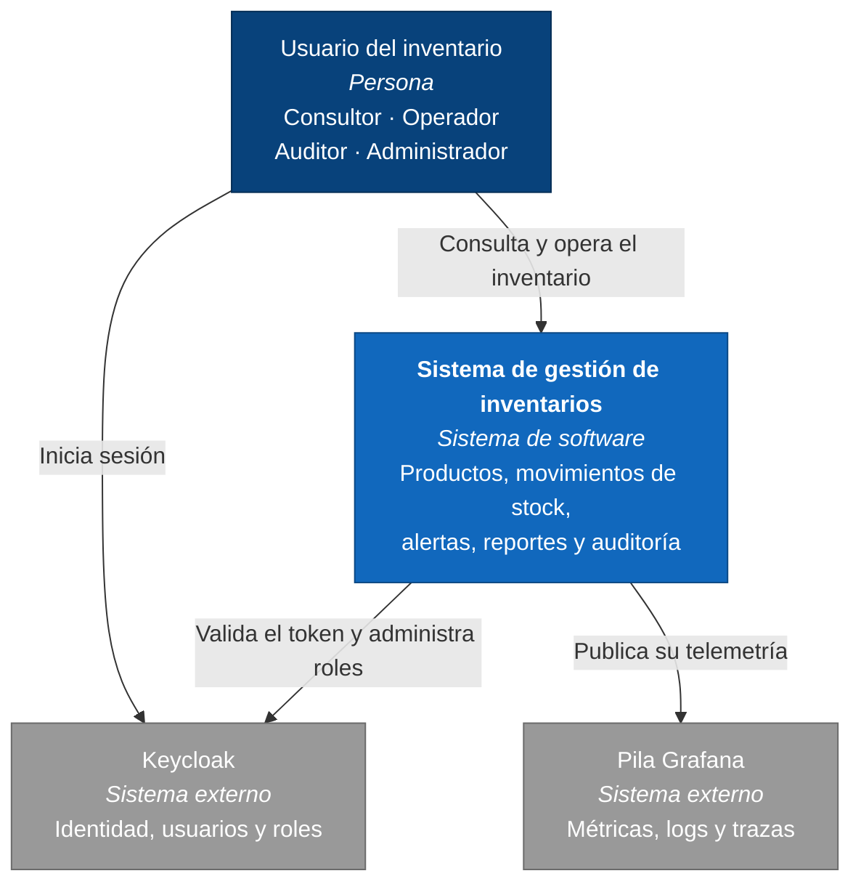
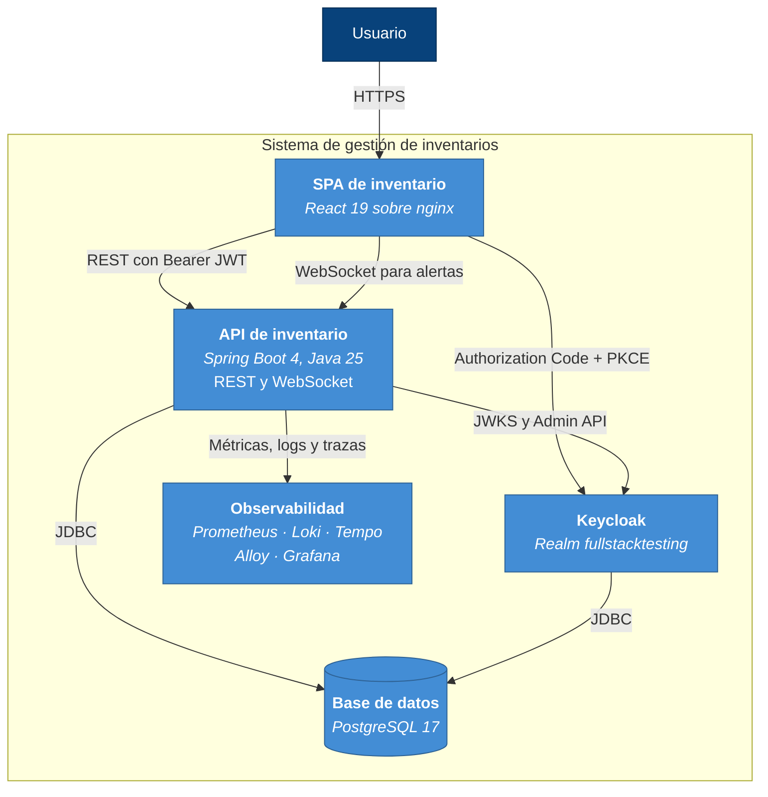
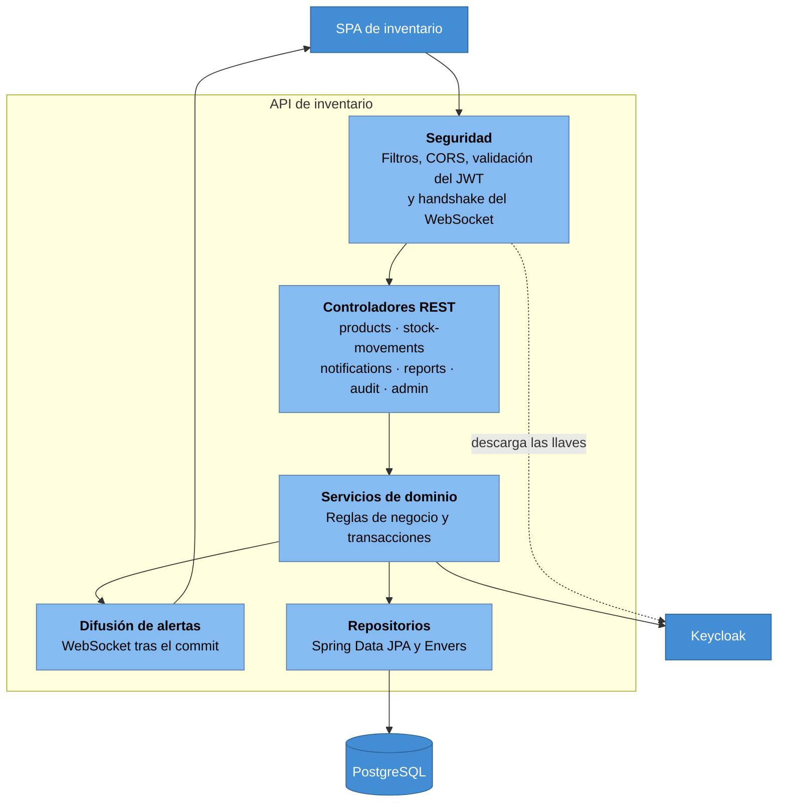
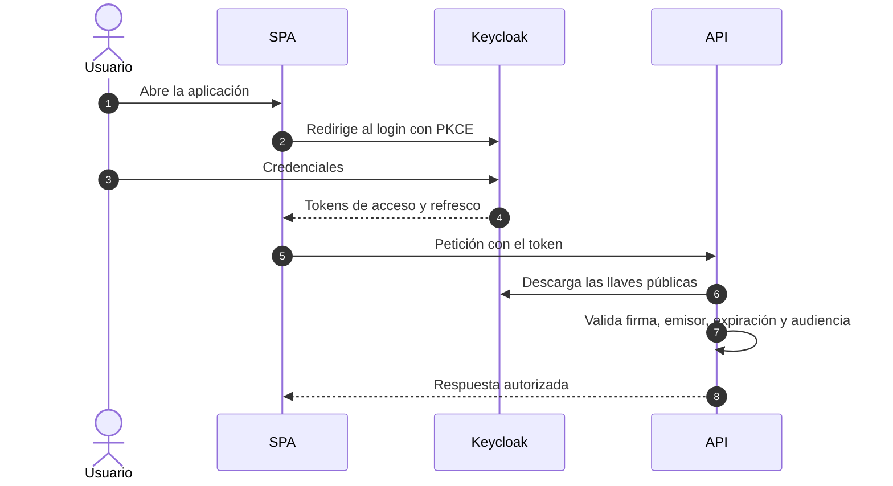
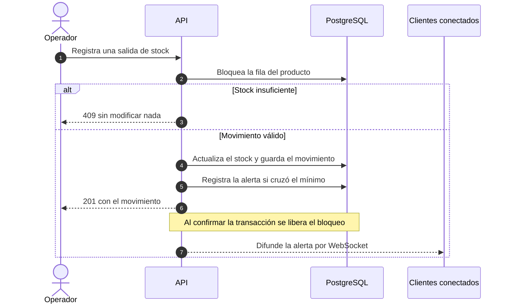
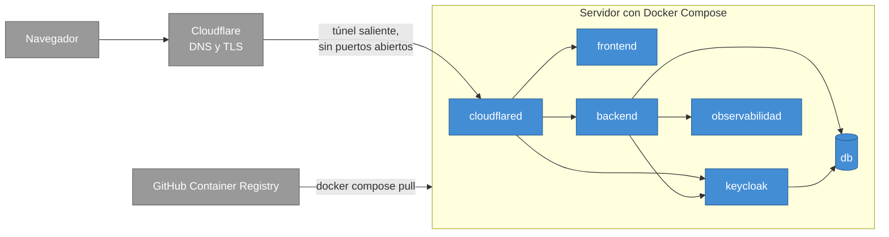
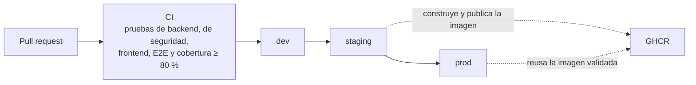

# Documentación de arquitectura

**Sistema de Gestión de Inventarios Empresarial** · versión 1.0 · 2026-08-01

Los diagramas siguen el **modelo C4** de Simon Brown: contexto (nivel 1), contenedores
(nivel 2) y componentes (nivel 3). El nivel 4 se omite a propósito —el propio modelo lo
desaconseja salvo en casos excepcionales—, y se añaden las vistas de ejecución y de despliegue.
Todo está en Mermaid dentro del Markdown, así que GitHub lo renderiza sin imágenes externas.

---

## 1. Objetivos y restricciones

Gestionar el inventario de una pequeña empresa con calidad demostrable. Tres objetivos
gobiernan el diseño, en este orden:

| # | Objetivo | Cómo se consigue |
|---|---|---|
| 1 | **Seguridad**: solo quien tiene el permiso exacto ejecuta cada operación | Keycloak con OIDC, permisos granulares dentro del JWT y doble barrera de autorización |
| 2 | **Trazabilidad**: todo cambio se puede reconstruir | Hibernate Envers audita productos y movimientos; el historial de stock es inmutable |
| 3 | **Verificabilidad**: cada requisito tiene una prueba que lo comprueba | Pruebas en cinco niveles y umbral de cobertura obligatorio en el build |

Restricciones de partida: Java 25 · Spring Boot 4 · PostgreSQL 17 · Keycloak 26 · React 19 ·
Docker Compose · Flyway · tres entornos (desarrollo, staging y producción) · observabilidad
con OpenTelemetry, Prometheus, Loki, Tempo y Grafana.

## 2. Contexto — C4 nivel 1

Cada rol accede solo a los módulos que sus permisos habilitan; la matriz completa está en el
[SRS](01-requisitos.md#322-autorización).

## 3. Estrategia de solución

| Decisión estructural | Motivo |
|---|---|
| API REST **sin estado**, autorizada por JWT | Se escala horizontalmente sin sesiones pegajosas |
| Permisos **dentro del token** | El backend no consulta a Keycloak en cada petición y los permisos cambian sin recompilar |
| Auditoría **declarativa** con Envers | El historial no depende de que el código recuerde escribirlo |
| Alertas por **evento transaccional** y WebSocket | Nada se difunde si la transacción no confirma |
| Esquema por **migraciones** con `ddl-auto=validate` | La aplicación no puede alterar el esquema en caliente |
| **Una imagen por componente**, configuración por entorno | La imagen validada en staging es la que llega a producción |

## 4. Contenedores — C4 nivel 2

| Contenedor | Puerto interno | Publicado en desarrollo |
|---|---|---|
| frontend (nginx) | 80 | 5173 |
| backend | 8080 | 8080 |
| keycloak | 8080 | 8081 |
| db | 5432 | 5432 |
| grafana · prometheus | 3000 · 9090 | 3001 · 9090 |

En staging y producción no se publica ningún puerto: todo el tráfico entra por el túnel de
Cloudflare (ver [§7](#7-despliegue)).

## 5. Componentes de la API — C4 nivel 3

Los errores de todos los controladores los traduce un único manejador global al formato
RFC 7807. En el frontend, la sesión y los permisos viven en `AuthContext`, las alertas en
`NotificationsContext`, y cada módulo tiene su cliente HTTP.

## 6. Vista de ejecución

### 6.1 Inicio de sesión

### 6.2 Registro de un movimiento con alerta en vivo

El bloqueo de la fila evita que dos movimientos simultáneos lean la misma cantidad previa. La
alerta se difunde **después** del commit: si la transacción se deshace, la alerta no existe y
tampoco se envía.

## 7. Despliegue

| Entorno | Rama | Origen público | Usuarios semilla |
|---|---|---|---|
| Desarrollo | `dev` | `http://localhost:5173` | Sí |
| Staging | `staging` | `https://stg.cloudsus.net` | Sí |
| Producción | `prod` | `https://app.cloudsus.net` | No |

Los tres realms se derivan de un único `keycloak/realm-export.json` con
`scripts/build-realms.py`, de modo que no pueden desincronizarse.

## 8. Conceptos transversales

### 8.1 Seguridad

La autorización se decide en capas sucesivas; ninguna sustituye a la anterior:

| Capa | Qué controla |
|---|---|
| Borde | TLS y túnel: el servidor no expone puertos |
| CORS | Solo los orígenes configurados, sin credenciales |
| Cabeceras | Política de contenido estricta en la API |
| Autenticación | JWT: firma, emisor, expiración y **audiencia** |
| Autorización por ruta | Barrera por módulo en la cadena de filtros |
| Autorización por operación | `@PreAuthorize` con el permiso fino |
| Validación | Bean Validation en los datos de entrada |
| Reglas de negocio | Unicidad, stock no negativo y bloqueo pesimista |
| Base de datos | Restricciones `UNIQUE`, `CHECK` y claves foráneas |

Tres detalles que sostienen el modelo:

- La validación de **audiencia** es explícita: comprobar solo el emisor dejaría entrar
  cualquier token del realm, aunque fuera de otro cliente.
- El WebSocket se autentica en el **handshake**, con el token como subprotocolo: el navegador
  no puede enviar la cabecera `Authorization` al abrir la conexión, y ponerlo en la URL lo
  dejaría en registros e historial.
- La política de contenido se escribe con `setHeader` y no `add`, para no enviar dos cabeceras
  que el navegador combinaría por intersección.

### 8.2 Auditoría y errores

Envers versiona `products` y `stock_movements` en tablas paralelas con una tabla de revisiones
que guarda usuario y marca de tiempo; los procesos sin sesión se registran como `system`. Las
respuestas de error usan `ProblemDetail` (RFC 7807): 404 no encontrado, 409 conflicto, 400
validación con el detalle por campo.

### 8.3 Observabilidad

El agente de OpenTelemetry viaja en la imagen del backend y envía trazas a Tempo. Micrometer
expone las métricas que Prometheus recoge; Alloy lleva los logs de los contenedores a Loki;
Grafana aprovisiona sus tableros y fuentes de datos al arrancar. El patrón de log incluye el
identificador de traza, de modo que desde un log se salta a su traza completa.

### 8.4 Integración y entrega continuas

Las imágenes se etiquetan por **hash del árbol de archivos**: un merge crea un commit nuevo
pero deja el mismo árbol, así que al promover `staging → prod` se despliega exactamente la
imagen que staging validó, sin recompilar.

## 9. Decisiones de arquitectura

| # | Decisión | Alternativa considerada | Motivo |
|---|---|---|---|
| AD-01 | Permisos granulares en roles compuestos de Keycloak | Roles gruesos por nombre | Cambiar quién puede hacer qué no exige recompilar |
| AD-02 | Validación explícita de audiencia en el JWT | Confiar solo en el emisor | Un token de otro cliente del realm entraría |
| AD-03 | Auditoría con Hibernate Envers | Escribir el historial a mano | No depende de que alguien lo recuerde |
| AD-04 | WebSocket nativo con subprotocolo `bearer` | STOMP o el token en la URL | Menos dependencias y el token no queda en registros |
| AD-05 | Difusión después del commit | Difundir dentro de la transacción | Si hay rollback, la alerta no existe |
| AD-06 | Bloqueo pesimista al mover stock | Bloqueo optimista con reintentos | La operación es corta y el conflicto, frecuente |
| AD-07 | Flyway con `ddl-auto=validate` | `ddl-auto=update` | El esquema es un artefacto revisable |
| AD-08 | Configuración del frontend al arrancar | Una imagen por entorno | La imagen validada sirve para todos |
| AD-09 | Etiquetado de imágenes por hash del árbol | Etiquetado por SHA de commit | Promover reusa la imagen ya validada |

---

## Anexos

- [Anexo B — Referencia de la API](anexo-b-api.md) *(generado desde OpenAPI)*
- [Anexo C — Esquema de base de datos](anexo-c-esquema-bd.md) *(generado desde la base real)*
