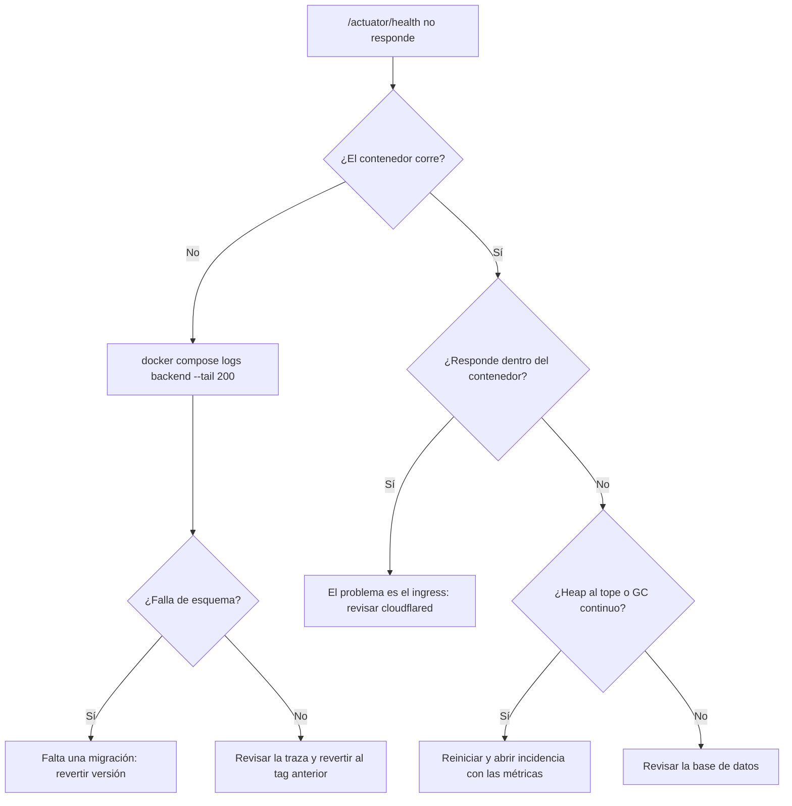

# Manual de mantenimiento

## 1. Rutina de operación

| Frecuencia | Tareas |
|---|---|
| Diaria | `docker compose ps` con todo *healthy*; revisar errores del día en los logs; comprobar espacio en disco; verificar que el job nocturno de seguridad terminó en verde |
| Semanal | Revisar latencia y errores en Grafana; probar que el último respaldo **restaura**; revisar el crecimiento de `notifications` y de las tablas de auditoría |
| Mensual | Actualizar dependencias; contrastar los umbrales de rendimiento con las mediciones de staging; `docker image prune` |
| Trimestral | Rotar contraseñas de Keycloak, PostgreSQL y Grafana; revisar la matriz de permisos; probar una reversión en staging |

```bash
cd /srv/fullstacktesting
docker compose -f docker-compose.yml -f docker-compose.deploy.yml ps
docker compose -f docker-compose.yml -f docker-compose.deploy.yml logs --since 24h backend | grep -iE "error|exception" | head -30
df -h /
```

## 2. Observabilidad

| Señal | Dónde | Umbral de atención |
|---|---|---|
| Disponibilidad | `/actuator/health` | Distinto de `UP` |
| Latencia p95 | Grafana → Spring Boot | > 500 ms sostenido |
| Tasa de 5xx | Grafana → Spring Boot | > 1 % |
| Uso de heap | Grafana → JVM Micrometer | > 85 % sostenido |
| Pool de conexiones | Grafana → JVM Micrometer | Pool agotado o espera creciente |
| 401 / 403 | Loki | Un pico indica realm mal configurado o ataque |
| Disco | `df -h` | > 80 % |

Tableros aprovisionados automáticamente en `monitoring/grafana/provisioning/dashboards/`:
JVM/Micrometer, Spring Boot, logs de aplicación y APM. Las fuentes de datos (Prometheus, Loki,
Tempo) también se aprovisionan solas.

```promql
histogram_quantile(0.95, sum(rate(http_server_requests_seconds_bucket{uri=~"/api/.*"}[5m])) by (le, uri))
sum(rate(http_server_requests_seconds_count{status=~"5.."}[5m])) / sum(rate(http_server_requests_seconds_count[5m])) * 100
jvm_memory_used_bytes{area="heap"} / jvm_memory_max_bytes{area="heap"} * 100
```

Retención de métricas: 15 días en staging, 30 en producción (`PROMETHEUS_RETENTION`).

## 3. Migraciones de base de datos

Reglas:

1. Una migración fusionada es **inmutable**; los errores se corrigen con una versión nueva.
2. Numeración correlativa: la siguiente es `V6__descripcion.sql`.
3. Debe poder aplicarse sobre una base con datos, no solo vacía.
4. Los cambios destructivos van en dos versiones: primero agregar y llenar, luego eliminar.
5. `spring.flyway.clean-disabled=true` en staging y producción.

```bash
touch src/main/resources/db/migration/V6__add_supplier_to_products.sql
# escribir el SQL, actualizar la entidad JPA (ddl-auto=validate no perdona diferencias)
./gradlew bootRun
./gradlew test --tests '*SchemaIntegrityIT'
```

Si una migración falla en producción: revisar `flyway_schema_history`, revertir la aplicación
al tag anterior, reparar el historial con `flyway repair` y corregir en una migración nueva.

## 4. Respaldos

| Dato | Dónde | Criticidad |
|---|---|---|
| Base `fullstacktesting` | volumen `pgdata` | Alta |
| Base `keycloak` | mismo volumen | Alta |
| `/srv/fullstacktesting/.env` | disco del servidor | Alta (no está en el repositorio) |
| `cloudflared/credentials.json` | disco del servidor | Alta |
| Volumen `grafanadata` | volumen | Media |

```bash
#!/usr/bin/env bash
# /srv/fullstacktesting/backup.sh — cron diario a las 03:00
set -euo pipefail
DESTINO=/srv/backups/$(date -u +%Y%m%dT%H%M%SZ)
mkdir -p "$DESTINO"
COMPOSE="docker compose -f /srv/fullstacktesting/docker-compose.yml -f /srv/fullstacktesting/docker-compose.deploy.yml"
$COMPOSE exec -T db pg_dump -U postgres -Fc fullstacktesting > "$DESTINO/fullstacktesting.dump"
$COMPOSE exec -T db pg_dump -U postgres -Fc keycloak        > "$DESTINO/keycloak.dump"
cp /srv/fullstacktesting/.env "$DESTINO/env.backup" && chmod 600 "$DESTINO/env.backup"
find /srv/backups -maxdepth 1 -type d -mtime +30 -exec rm -rf {} +
```

Restauración:

```bash
docker compose -f docker-compose.yml -f docker-compose.deploy.yml stop backend frontend
cat /srv/backups/FECHA/fullstacktesting.dump | docker compose ... exec -T db \
  pg_restore -U postgres -d fullstacktesting --clean --if-exists
docker compose -f docker-compose.yml -f docker-compose.deploy.yml up -d --wait
```

Probar la restauración al menos una vez al mes sobre una base descartable: un dump que nunca
se restauró no es un respaldo.

## 5. Runbooks

### 5.1 El backend no responde



### 5.2 La base de datos no acepta conexiones

```bash
docker compose logs db --tail 100
docker compose exec db pg_isready -U postgres -d fullstacktesting
df -h /                                   # disco lleno es la causa más común
docker compose exec db psql -U postgres -c "SELECT count(*) FROM pg_stat_activity;"
```

Transacciones colgadas:

```sql
SELECT pid, state, query_start, left(query, 80) FROM pg_stat_activity
WHERE state <> 'idle' AND query_start < now() - interval '5 minutes';
```

### 5.3 Keycloak caído o realm perdido

Síntoma: todo responde 401 y el login no carga.

```bash
docker compose logs keycloak --tail 100
curl -fsS https://auth-stg.cloudsus.net/realms/fullstacktesting/.well-known/openid-configuration
```

El realm se importa solo al arrancar, así que reiniciar el contenedor lo restaura. Keycloak
guarda su estado en la base `keycloak`, creada por `db/init/01-create-keycloak-db.sh` en el
primer arranque del volumen. Reimportar no borra los usuarios creados después.

### 5.4 Revertir una versión

Desde GitHub: **Actions → Deploy → Run workflow**, indicando entorno y el tag anterior.
Revertir la aplicación **no** revierte migraciones ya aplicadas: por eso los cambios
destructivos van en dos despliegues.

### 5.5 Las alertas en vivo no llegan

1. ¿Existe la alerta en la base? `SELECT * FROM notifications ORDER BY id DESC LIMIT 5;`
   Si no, comprobar que el movimiento realmente cruzó el umbral: solo se alerta en la
   transición.
2. ¿Conectó el WebSocket? En la pestaña Red del navegador debe verse un 101. Un 401 indica
   token ausente o inválido; un 403, que al usuario le falta `product:view`.
3. Si conectó pero no llega nada, revisar en los logs si la sesión se descartó por atasco o
   error de transporte.

## 6. Datos

| Tabla | Crecimiento | Política |
|---|---|---|
| `stock_movements` | Alto | Conservar: es el historial del negocio |
| `notifications` | Medio | Purgar las leídas con más de 90 días |
| `products_aud`, `stock_movements_aud`, `revinfo` | Alto | Conservar por requisito de auditoría |

```sql
SELECT relname, pg_size_pretty(pg_total_relation_size(relid)) AS tamano
FROM pg_catalog.pg_statio_user_tables ORDER BY pg_total_relation_size(relid) DESC;

DELETE FROM notifications WHERE read = true AND created_at < now() - interval '90 days';
```

Conciliación entre el stock y su historial (productos sin ajustes):

```sql
SELECT p.id, p.sku, p.quantity,
       COALESCE(SUM(CASE m.movement_type WHEN 'IN' THEN m.quantity WHEN 'OUT' THEN -m.quantity END), 0) AS suma
FROM products p LEFT JOIN stock_movements m ON m.product_id = p.id
WHERE NOT EXISTS (SELECT 1 FROM stock_movements a WHERE a.product_id = p.id AND a.movement_type = 'ADJUSTMENT')
GROUP BY p.id, p.sku, p.quantity
HAVING p.quantity <> COALESCE(SUM(CASE m.movement_type WHEN 'IN' THEN m.quantity WHEN 'OUT' THEN -m.quantity END), 0);
```

Cualquier fila devuelta es una anomalía a investigar.

## 7. Dependencias

```bash
./gradlew dependencyCheckAnalyze     # CVE, falla con CVSS >= 7.0
./gradlew test securityTest          # portón antes de subir
cd frontend && npm outdated && npm audit --audit-level=high && npm run build
```

Las versiones de las imágenes base están fijadas a propósito; subirlas es un cambio
deliberado que pasa primero por staging. Los falsos positivos de Dependency-Check se
registran en `config/owasp-suppressions.xml` con su justificación.

## 8. Secretos

| Secreto | Ubicación | Rotación |
|---|---|---|
| Contraseña de PostgreSQL | `.env` del servidor | Trimestral |
| Contraseña de admin de Keycloak | `.env` del servidor | Trimestral |
| Contraseña de Grafana | `.env` del servidor | Trimestral |
| Credenciales del túnel | `cloudflared/credentials.json` | Al cambiar el túnel |
| Llave SSH de despliegue | Secretos de GitHub | Semestral |

Ningún secreto va al repositorio: `.env*` está ignorado y los ejemplos solo traen `CAMBIAME`.

```bash
# Rotar la contraseña de PostgreSQL
docker compose exec db psql -U postgres -c "ALTER USER postgres WITH PASSWORD 'nueva';"
sed -i "s|^POSTGRES_PASSWORD=.*|POSTGRES_PASSWORD=nueva|" /srv/fullstacktesting/.env
docker compose -f docker-compose.yml -f docker-compose.deploy.yml up -d --force-recreate backend keycloak
```

## 9. Usuarios y permisos

La operación normal se hace desde `/users` en la aplicación, con un usuario que tenga
`user:manage`. En producción el realm no trae usuarios semilla: el primer administrador se
crea en la consola de Keycloak y se le asigna `INVENTORY_ADMIN`.

Para agregar un permiso nuevo:

1. Crear el rol de permiso en `keycloak/realm-export.json`.
2. Añadirlo a los roles compuestos que correspondan.
3. Regenerar los realms derivados: `python3 scripts/build-realms.py`.
4. Usarlo en el backend (`@PreAuthorize` y `SecurityConfig`) y en el frontend (`hasPermission`).
5. Extender la matriz de `AuthorizationMatrixIT`.
6. Documentarlo en [01-requisitos.md](01-requisitos.md).

## 10. Lista de verificación de entrega

**Antes de promover a producción**

- [ ] CI en verde en `staging` (backend, seguridad, frontend, E2E)
- [ ] Cobertura ≥ 80 %
- [ ] Suite de rendimiento ejecutada si hubo cambios sensibles
- [ ] Migraciones nuevas probadas sobre una copia de datos reales
- [ ] Respaldo del día verificado
- [ ] Tag de la versión actual anotado para poder revertir

**Después de desplegar**

- [ ] `docker compose ps` con todo *healthy*
- [ ] Verificación posterior de [03-instalacion.md](03-instalacion.md#7-verificación-posterior)
- [ ] Un flujo real completo: login, alta, movimiento, alerta
- [ ] Grafana sin picos de error en los primeros 15 minutos

## 11. Convenciones del repositorio

| Rama | Propósito |
|---|---|
| `dev` | Integración del trabajo diario |
| `staging` | Preproducción; avanza por *fast-forward* desde `dev` |
| `prod` | Producción; avanza por *fast-forward* desde `staging` |
| `feat/*`, `fix/*`, `chore/*` | Trabajo puntual, entra por pull request |

Mensajes de commit en formato convencional (`feat(ui):`, `fix(api):`, `test(e2e):`).
