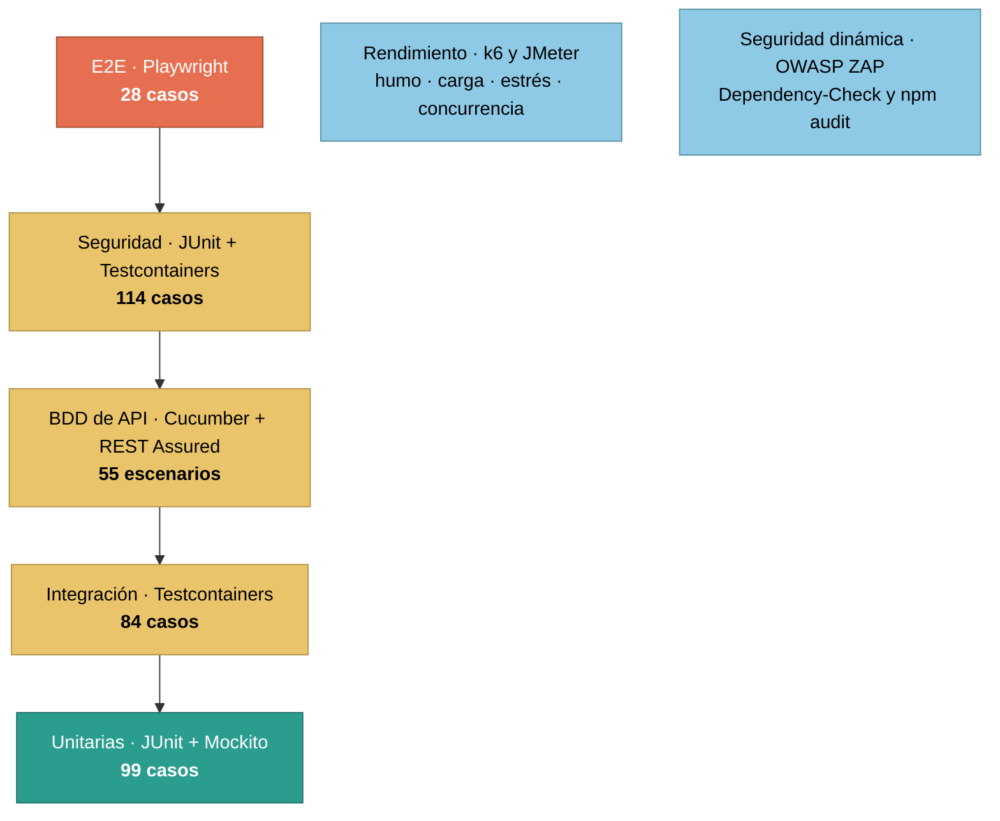
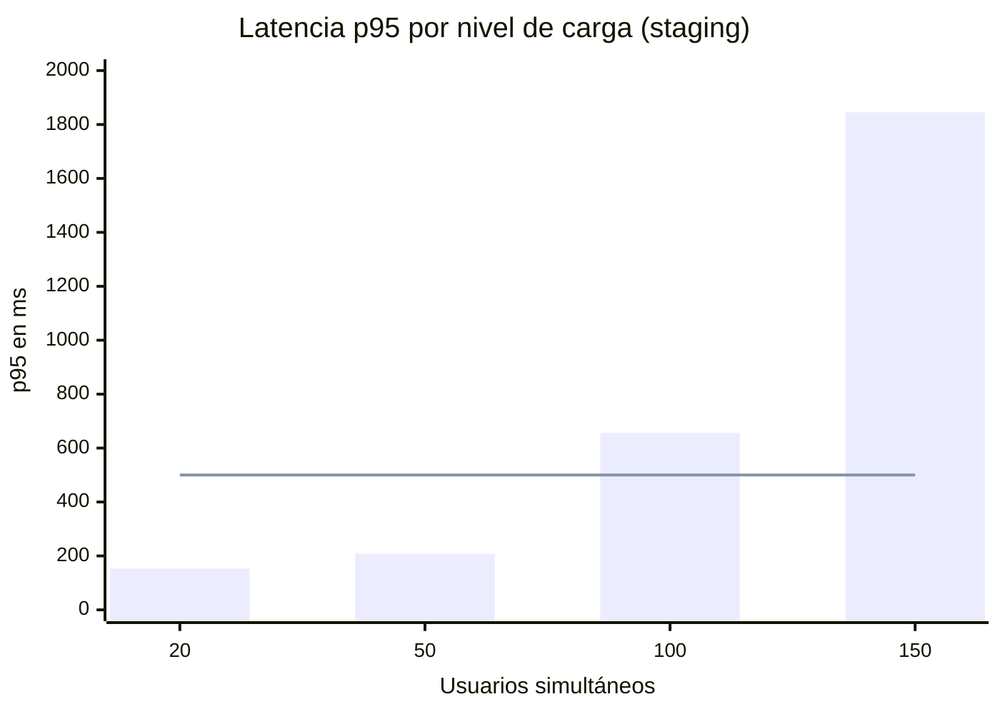

# Guía de pruebas

**Sistema de Gestión de Inventarios Empresarial** · versión 1.0 · 2026-07-29

Documento estructurado según **ISO/IEC/IEEE 29119-3:2021** (sustituye a IEEE 829-2008), con
*conformidad adaptada* (cláusula 4.1.3): se conservan el **plan de pruebas** (7.2), la
**especificación de casos** (8.3) y el **informe de cierre** (7.4), que son los aplicables a un
sistema de este tamaño.

El catálogo completo de casos está en el
[Anexo A — Casos de prueba](anexo-a-casos-de-prueba.md), generado desde los resultados reales.

---

## 1. Plan de pruebas

### 1.1 Contexto

Se prueban la API REST y WebSocket, la SPA, el modelo de autorización, el esquema de datos y
el rendimiento del sistema desplegado. Queda fuera Keycloak como producto —se prueba su
integración, no su implementación— y la infraestructura de Cloudflare.

### 1.2 Estrategia



**Tipos de prueba y técnicas de diseño**

| Nivel | Tipo | Técnica de diseño | Herramientas |
|---|---|---|---|
| Unitario | Funcional de componente | Partición de equivalencia, valores límite, tabla de decisión para los umbrales de alerta | JUnit 5, Mockito, AssertJ |
| Integración | Integración con base de datos y proveedor de identidad | Pruebas basadas en estado | Testcontainers (PostgreSQL, Keycloak) |
| API | Contrato y comportamiento HTTP | Escenarios BDD *dado-cuando-entonces*, clases válidas e inválidas | Cucumber 7 en español, REST Assured |
| Seguridad | Autenticación, autorización, CORS, cabeceras | Matriz rol × endpoint y ataques conocidos sobre el token | JUnit, Nimbus JOSE, Testcontainers, OWASP ZAP |
| Sistema | Extremo a extremo por la interfaz | Flujos de usuario y de negocio, con capturas de cada pantalla | Playwright sobre Chromium |
| Rendimiento | Carga, estrés y concurrencia | Perfiles de carga con umbrales declarados | k6, JMeter |
| Datos | Integridad y consistencia | Verificación de restricciones e invariantes sobre datos sembrados | JUnit, SQL directo, semillas de Flyway |
| Estático | Calidad de código | Reglas de fiabilidad, seguridad y mantenibilidad | SonarQube |

**Principios**

- Sin dobles donde importa: la integración usa PostgreSQL y Keycloak reales, no bases en
  memoria ni tokens falsos.
- Determinismo: los E2E esperan condiciones, no tiempos, y corren en serie.
- Aislamiento: cada escenario crea sus datos con identificadores únicos.
- Lo lento, fuera del camino crítico: el escaneo dinámico y el análisis de dependencias corren
  de noche; las pruebas de carga, a mano contra staging.

### 1.3 Criterios de entrada, salida y completitud

| Criterio | Definición |
|---|---|
| Entrada | El código compila, el entorno levanta y las migraciones aplican |
| Salida | Los cinco controles del portón en verde: pruebas de backend, de seguridad, *lint* y compilación del frontend, E2E, y cobertura ≥ 80 % |
| Completitud | Todo requisito del SRS tiene al menos un caso que lo verifica y todos los casos ejecutados pasan |
| Suspensión | Si el entorno no levanta, la ejecución se detiene y se corrige antes de continuar |

### 1.4 Métricas

Cobertura de instrucciones y de ramas (JaCoCo); casos ejecutados y fallidos por nivel; tiempo
de ejecución de cada suite; y en rendimiento: tiempo de respuesta p95 y p99, *throughput*,
porcentaje de peticiones fallidas y usuarios concurrentes.

### 1.5 Entorno y datos de prueba

| Suite | Infraestructura |
|---|---|
| Unitarias | JVM, sin contexto de Spring |
| Integración y BDD | `@SpringBootTest` con puerto aleatorio; PostgreSQL 17 y Keycloak 26.3 en Testcontainers |
| Seguridad | Tarea Gradle independiente, con sus propios contenedores |
| E2E | Stack completo de Docker Compose |
| Rendimiento | k6 y JMeter en contenedores, contra staging desplegado |

Datos: los cinco usuarios del realm (`admin`, `operator`, `auditor`, `user1`, `user2`), cada
uno con un conjunto distinto de permisos; `user2` no tiene ninguno, y sirve para verificar los
403. Los productos se crean por escenario con SKU único, de modo que ningún caso depende del
estado que dejó otro.

El entorno de desarrollo se siembra además con `db/seed/R__seed_demo_data.sql`: diez productos
que cubren stock sano, crítico, sin stock e inactivo, con su historial de movimientos cuadrado
con la existencia de cada uno. Es una migración repetible e idempotente, y solo se carga en el
perfil `dev`: la suite corre con el perfil `test`, así que las semillas no alteran ningún
resultado.

### 1.6 Riesgos considerados

| Riesgo | Mitigación |
|---|---|
| Un fallo de autorización expone datos | Matriz completa rol × endpoint ejecutada en cada PR |
| Se acepta un token manipulado | Batería de ataques sobre el JWT en cada PR |
| La concurrencia corrompe el stock | Bloqueo pesimista y escenario de concurrencia con umbral de consistencia |
| Una migración rompe el esquema | `ddl-auto=validate` y pruebas de integridad del esquema |
| Las pruebas de carga dan resultados irreproducibles | Se ejecutan contra staging, no en un ejecutor compartido |

---

## 2. Especificación de casos de prueba

Cada caso documenta los campos exigidos por la cláusula 8.3.3: **identificador único**,
**objetivo**, **prioridad**, **trazabilidad**, **precondiciones**, **entradas** y **resultado
esperado**. En el código, el identificador y el objetivo están en el nombre del caso o en su
`@DisplayName`; la trazabilidad al requisito, en la columna *Verificación* del
[SRS](01-requisitos.md); las precondiciones, entradas y resultado esperado son la preparación,
la acción y las aserciones de cada caso.

El catálogo completo, con los 380 identificadores, está en el
[Anexo A](anexo-a-casos-de-prueba.md). Un ejemplo por nivel:

| Campo | UT-MOV-07 (unitario) | BDD-MOV-03 (API) | SEC-JWT-10 (seguridad) | E2E-STOCK-01 (sistema) |
|---|---|---|---|---|
| Objetivo | Una salida de una unidad más que el stock no lo deja en negativo | Una salida mayor al stock disponible se rechaza | Un token de otro cliente del realm no entra a la API | Quitar 4 unidades a un producto con 6 lo deja en 2 |
| Prioridad | Alta | Alta | Alta | Alta |
| Trazabilidad | RF-33, RN-02 | RF-32 | RNF-02 | RF-31, RF-32 |
| Precondiciones | Producto con cantidad 6 | Usuario `admin` autenticado, producto con cantidad 10 | Realm con dos clientes | Sesión iniciada, producto con 6 unidades |
| Entradas | Movimiento `OUT` de 7 unidades | `POST /api/stock-movements` con 50 unidades | Token emitido para otro cliente | Formulario de movimiento: salida de 4 |
| Resultado esperado | Excepción de stock insuficiente; el stock sigue en 6 | **409** con cuerpo RFC 7807 | **401** | La tabla muestra 2 unidades |

### 2.1 Cobertura de las áreas exigidas

| Área | Cómo se cubre |
|---|---|
| Pruebas unitarias | 99 casos sobre servicios, validaciones y lógica de negocio |
| Pruebas de integración | 84 casos con base de datos y Keycloak reales en Testcontainers |
| API y contrato | 55 escenarios BDD: endpoints, códigos de estado, cargas útiles y contrato OpenAPI |
| Extremo a extremo | 28 escenarios de flujo completo, navegación, roles y seguridad en la interfaz, más las capturas de pantalla del [Anexo D](anexo-d-interfaz.md) |
| Seguridad | 114 casos de JWT, permisos, CORS y autenticación, más escaneo OWASP ZAP y análisis de dependencias en el flujo nocturno |
| Rendimiento | Cuatro escenarios k6 y un plan JMeter: carga, estrés, concurrencia, tiempo de respuesta y *throughput* |
| Datos | 20 casos de migraciones, restricciones, integridad referencial, duplicados y consistencia de agregados, sobre datos sembrados de forma reproducible |
| Calidad de código | Análisis estático con SonarQube: fiabilidad, seguridad, mantenibilidad, duplicación y cobertura importada de JaCoCo |

---

## 3. Informe de cierre

### 3.1 Resumen de lo ejecutado

Ejecución del **2026-07-29** sobre el commit `63dac89`, con Docker 29.4, JDK 25 y Chromium.

| Suite | Comando | Casos | Pasan | Fallan | Tiempo |
|---|---|---:|---:|---:|---:|
| Unitarias, integración y BDD | `./gradlew test` | 238 | 238 | 0 | 29,4 s |
| Seguridad | `./gradlew securityTest` | 114 | 114 | 0 | 92,3 s |
| Extremo a extremo | `npx playwright test` | 28 | 28 | 0 | 10,5 s |
| **Total** | | **380** | **380** | **0** | **≈ 2 min 20 s** |

Detalle por clase y por escenario: [Anexo A](anexo-a-casos-de-prueba.md).

### 3.2 Cobertura de código

| Métrica | Cubierto | Total | % |
|---|---:|---:|---:|
| Instrucciones | 2 866 | 2 976 | **96,3 %** |
| Líneas | 552 | 573 | 96,3 % |
| Métodos | 159 | 171 | 93,0 % |
| Clases | 54 | 54 | 100 % |
| Ramas | 123 | 146 | 84,2 % |

Umbral exigido por el build: **80 % de instrucciones**, excluyendo la clase de arranque. El
resultado lo supera por 16,3 puntos. Por paquete: `audit`, `domain`, `dto`, `exception` y `ws`
al 100 %; `config` 99,3 %; `service` 96,3 %.

### 3.3 Resultados de rendimiento

Ejecutados contra staging con `./scripts/perf-staging.sh`; datos crudos archivados en
`performance/results/staging/`.

**Humo** — 1 usuario, 51 peticiones: 0 % de fallos, 100 % de verificaciones en verde, p95
191,8 ms.

**Estrés** — escalones de 20 a 150 usuarios, 45 344 peticiones, 115,9 req/s:

| Usuarios simultáneos | Media | p95 | p99 | Comportamiento |
|---:|---:|---:|---:|:--|
| 20 | 109,3 ms | 152,7 ms | 213,8 ms | dentro del objetivo |
| 50 | 126,7 ms | 208,3 ms | 275,4 ms | dentro del objetivo |
| 100 | 278,0 ms | 656,6 ms | 991,8 ms | inicio de saturación |
| 150 | 624,0 ms | 1845,2 ms | 2396,3 ms | saturación |



**Capacidad medida: 50 usuarios simultáneos** cumpliendo los objetivos de tiempo de respuesta
y de error, sobre un único servidor de staging. Localizar el escalón donde empieza la
saturación es justamente el resultado que se busca en un estrés: da la cifra de capacidad con
la que dimensionar el entorno y el punto de partida para escalar horizontalmente, algo que la
API permite por ser sin estado.

**JMeter** — plan equivalente al de carga, con tablero HTML navegable: 0 % de errores, media
286,8 ms, p95 460 ms.

### 3.4 Evaluación de completitud

| Criterio | Resultado |
|---|---|
| Todos los casos ejecutados pasan | 380 / 380 |
| Cobertura de instrucciones ≥ 80 % | 96,3 % |
| Todo requisito del SRS tiene verificación asignada | Sí, columna *Verificación* del SRS |
| Las siete áreas de prueba exigidas están cubiertas | Sí, ver §2.1 |
| Objetivos de rendimiento con la carga nominal | Cumplidos hasta 50 usuarios simultáneos |

### 3.5 Entregables

Los informes completos están versionados en `docs/reportes/`, de modo que se pueden abrir sin
volver a ejecutar nada: basta clonar el repositorio y abrir el `index.html` correspondiente.

| Artefacto | Versionado en | Lo produce |
|---|---|---|
| Pruebas de backend | [`docs/reportes/pruebas/index.html`](reportes/pruebas/index.html) | `./gradlew test` |
| Pruebas de seguridad | [`docs/reportes/seguridad/index.html`](reportes/seguridad/index.html) | `./gradlew securityTest` |
| Escenarios BDD | [`docs/reportes/cucumber.html`](reportes/cucumber.html) | Cucumber, dentro de `test` |
| Cobertura JaCoCo | [`docs/reportes/cobertura/index.html`](reportes/cobertura/index.html) | `./gradlew jacocoTestReport` |
| Extremo a extremo | [`docs/reportes/e2e/index.html`](reportes/e2e/index.html) | `npx playwright test` |
| Rendimiento | `performance/results/staging/<marca de tiempo>/` | `./scripts/perf-staging.sh` |
| Catálogo de casos | [Anexo A](anexo-a-casos-de-prueba.md) | `scripts/docs/generate.sh tests` |

Se actualizan con `bash scripts/docs/generate.sh reportes`, que los copia desde `build/`. En
cada ejecución de integración continua los mismos artefactos se publican además como adjuntos
del flujo de trabajo.

---

## 4. Cómo reproducir

```bash
docker compose up -d                 # entorno completo

./gradlew test                       # 238 casos y cobertura
./gradlew securityTest               # 114 casos
npx playwright test                  # 28 casos

./scripts/perf-staging.sh            # humo y carga contra staging
./scripts/perf-staging.sh stress     # estrés
./gradlew zapScan                    # escaneo OWASP ZAP
./gradlew dependencyCheckAnalyze     # análisis de dependencias

# Análisis estático: lee los informes de las pruebas, así que va después de ellas
docker run --rm -v "$PWD:/usr/src" -e SONAR_HOST_URL -e SONAR_TOKEN sonarsource/sonar-scanner-cli
```

La configuración del análisis vive en `sonar-project.properties`: fuentes de Java y
TypeScript, informes de JUnit de ambas tareas y cobertura importada del XML de JaCoCo.

Ejecuciones puntuales:

```bash
./gradlew test --tests '*ProductServiceTest'
./gradlew test --tests '*RunCucumberTest*'
npx playwright test e2e/inventory.spec.ts --ui
```

Requisitos: Docker en marcha (Testcontainers), JDK 25 y, para E2E,
`npx playwright install --with-deps chromium`.

Regenerar el catálogo del Anexo A tras una ejecución nueva:

```bash
bash scripts/docs/generate.sh tests
```
