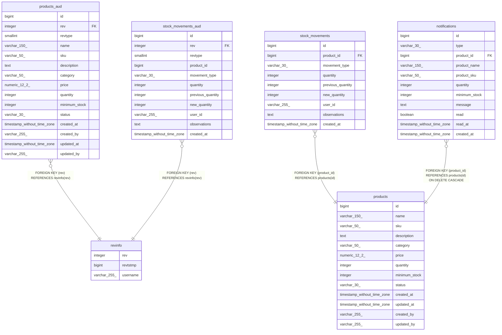

# Anexo C — Esquema de base de datos

Documento **generado** con [tbls](https://github.com/k1LoW/tbls) a partir de la base de datos
real, después de aplicar las migraciones de Flyway. No se edita a mano.

```bash
bash scripts/docs/generate.sh db
```

---

## Diagrama entidad-relación



## Tablas


### `products`

| Columna | Tipo | Nulo | Por defecto |
|---|---|---|---|
| `id` | bigint | no | nextval('products_id_seq'::regclass) |
| `name` | varchar(150) | no | — |
| `sku` | varchar(50) | no | — |
| `description` | text | sí | — |
| `category` | varchar(50) | sí | — |
| `price` | numeric(12,2) | no | — |
| `quantity` | integer | no | 0 |
| `minimum_stock` | integer | no | 0 |
| `status` | varchar(30) | no | 'ACTIVE'::character varying |
| `created_at` | timestamp without time zone | no | now() |
| `updated_at` | timestamp without time zone | no | now() |
| `created_by` | varchar(255) | sí | — |
| `updated_by` | varchar(255) | sí | — |

**Restricciones**

- `chk_min_stock` — CHECK ((minimum_stock >= 0))
- `chk_price` — CHECK ((price >= (0)::numeric))
- `chk_quantity` — CHECK ((quantity >= 0))
- `chk_status` — CHECK (((status)::text = ANY ((ARRAY['ACTIVE'::character varying, 'INACTIVE'::character varying])::text[])))
- `products_pkey` — PRIMARY KEY (id)
- `products_sku_key` — UNIQUE (sku)

**Índices**

- `products_pkey`
- `products_sku_key`

### `revinfo`

| Columna | Tipo | Nulo | Por defecto |
|---|---|---|---|
| `rev` | integer | no | — |
| `revtstmp` | bigint | sí | — |
| `username` | varchar(255) | sí | — |

**Restricciones**

- `revinfo_pkey` — PRIMARY KEY (rev)

**Índices**

- `revinfo_pkey`

### `products_aud`

| Columna | Tipo | Nulo | Por defecto |
|---|---|---|---|
| `id` | bigint | no | — |
| `rev` | integer | no | — |
| `revtype` | smallint | sí | — |
| `name` | varchar(150) | sí | — |
| `sku` | varchar(50) | sí | — |
| `description` | text | sí | — |
| `category` | varchar(50) | sí | — |
| `price` | numeric(12,2) | sí | — |
| `quantity` | integer | sí | — |
| `minimum_stock` | integer | sí | — |
| `status` | varchar(30) | sí | — |
| `created_at` | timestamp without time zone | sí | — |
| `created_by` | varchar(255) | sí | — |
| `updated_at` | timestamp without time zone | sí | — |
| `updated_by` | varchar(255) | sí | — |

**Restricciones**

- `fk_products_aud_rev` — FOREIGN KEY (rev) REFERENCES revinfo(rev)
- `products_aud_pkey` — PRIMARY KEY (id, rev)

**Índices**

- `products_aud_pkey`

### `stock_movements`

| Columna | Tipo | Nulo | Por defecto |
|---|---|---|---|
| `id` | bigint | no | nextval('stock_movements_id_seq'::regclass) |
| `product_id` | bigint | no | — |
| `movement_type` | varchar(30) | no | — |
| `quantity` | integer | no | — |
| `previous_quantity` | integer | no | — |
| `new_quantity` | integer | no | — |
| `user_id` | varchar(255) | no | — |
| `observations` | text | sí | — |
| `created_at` | timestamp without time zone | no | now() |

**Restricciones**

- `chk_movement_quantity` — CHECK ((quantity > 0))
- `chk_movement_type` — CHECK (((movement_type)::text = ANY ((ARRAY['IN'::character varying, 'OUT'::character varying, 'ADJUSTMENT'::character varying])::text[])))
- `chk_new_quantity` — CHECK ((new_quantity >= 0))
- `fk_stock_movements_product` — FOREIGN KEY (product_id) REFERENCES products(id)
- `stock_movements_pkey` — PRIMARY KEY (id)

**Índices**

- `stock_movements_pkey`
- `idx_stock_movements_product`
- `idx_stock_movements_created_at`

### `stock_movements_aud`

| Columna | Tipo | Nulo | Por defecto |
|---|---|---|---|
| `id` | bigint | no | — |
| `rev` | integer | no | — |
| `revtype` | smallint | sí | — |
| `product_id` | bigint | sí | — |
| `movement_type` | varchar(30) | sí | — |
| `quantity` | integer | sí | — |
| `previous_quantity` | integer | sí | — |
| `new_quantity` | integer | sí | — |
| `user_id` | varchar(255) | sí | — |
| `observations` | text | sí | — |
| `created_at` | timestamp without time zone | sí | — |

**Restricciones**

- `fk_stock_movements_aud_rev` — FOREIGN KEY (rev) REFERENCES revinfo(rev)
- `stock_movements_aud_pkey` — PRIMARY KEY (id, rev)

**Índices**

- `stock_movements_aud_pkey`

### `notifications`

| Columna | Tipo | Nulo | Por defecto |
|---|---|---|---|
| `id` | bigint | no | nextval('notifications_id_seq'::regclass) |
| `type` | varchar(30) | no | — |
| `product_id` | bigint | no | — |
| `product_name` | varchar(150) | no | — |
| `product_sku` | varchar(50) | no | — |
| `quantity` | integer | no | — |
| `minimum_stock` | integer | no | — |
| `message` | text | no | — |
| `read` | boolean | no | false |
| `read_at` | timestamp without time zone | sí | — |
| `created_at` | timestamp without time zone | no | now() |

**Restricciones**

- `chk_notification_minimum` — CHECK ((minimum_stock >= 0))
- `chk_notification_quantity` — CHECK ((quantity >= 0))
- `chk_notification_read_at` — CHECK ((read = (read_at IS NOT NULL)))
- `chk_notification_type` — CHECK (((type)::text = ANY ((ARRAY['LOW_STOCK'::character varying, 'OUT_OF_STOCK'::character varying])::text[])))
- `fk_notifications_product` — FOREIGN KEY (product_id) REFERENCES products(id) ON DELETE CASCADE
- `notifications_pkey` — PRIMARY KEY (id)

**Índices**

- `notifications_pkey`
- `idx_notifications_created_at`
- `idx_notifications_product`
