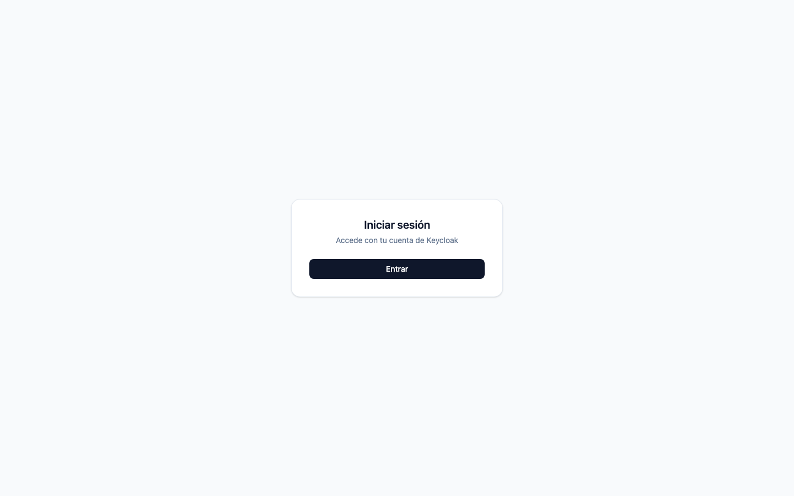
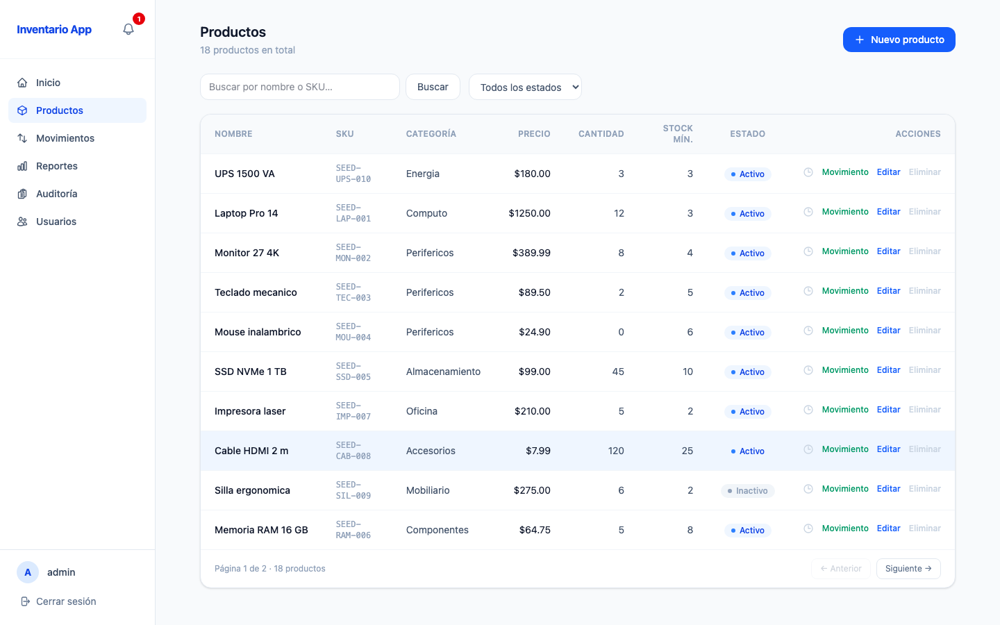
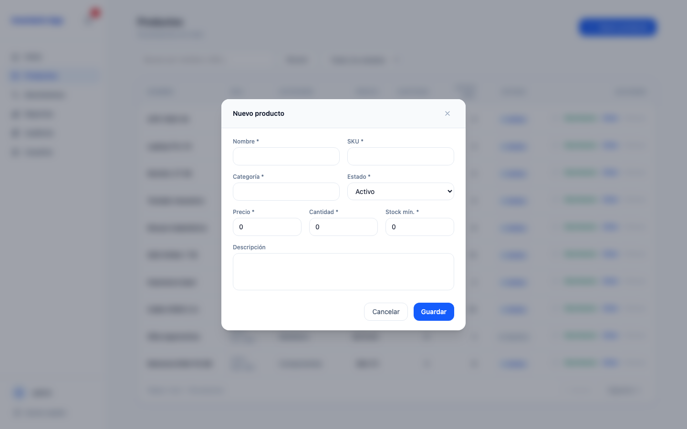
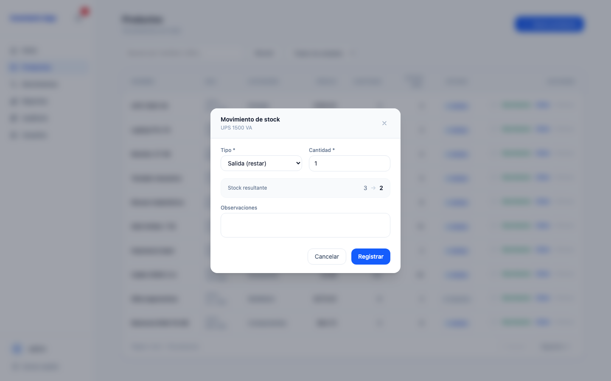
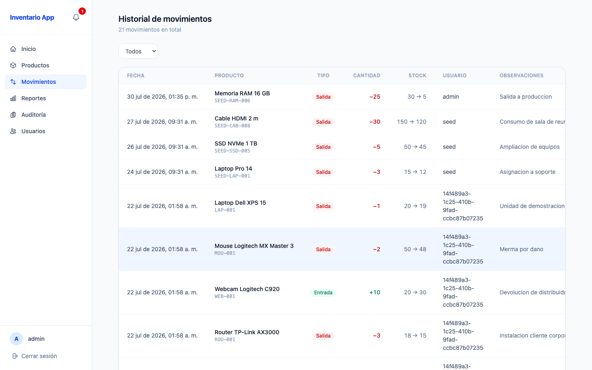
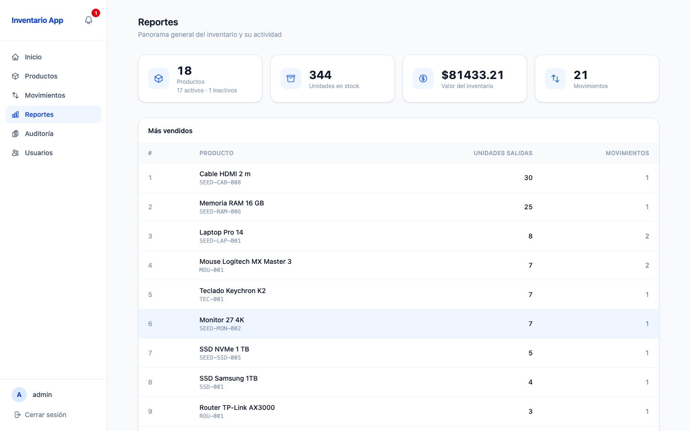
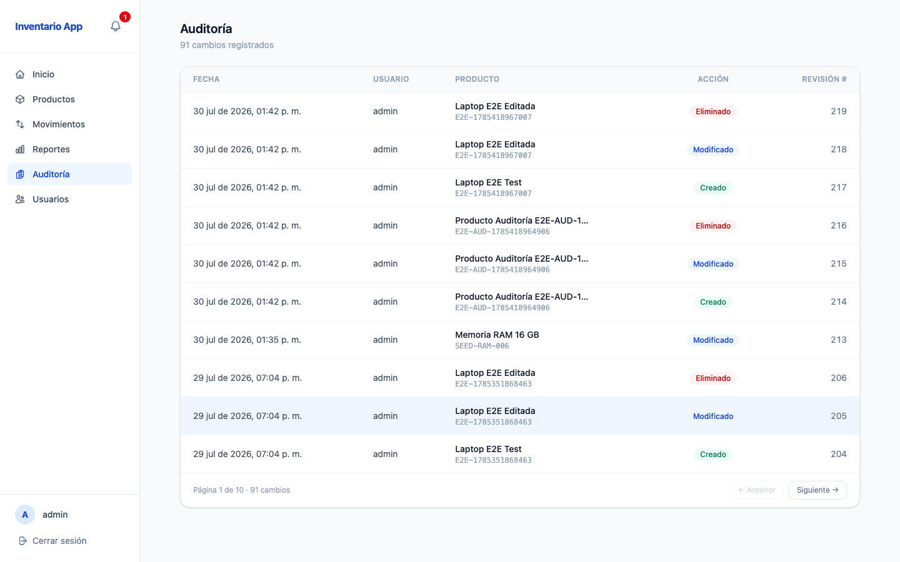
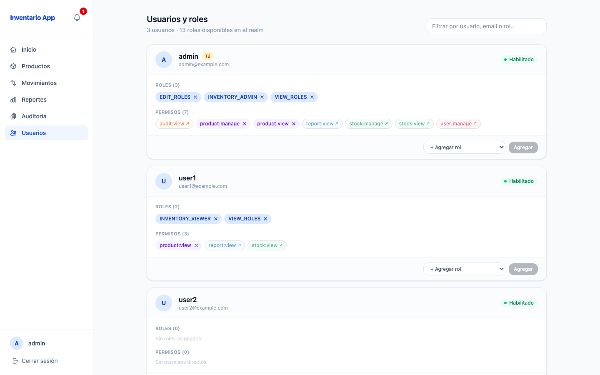
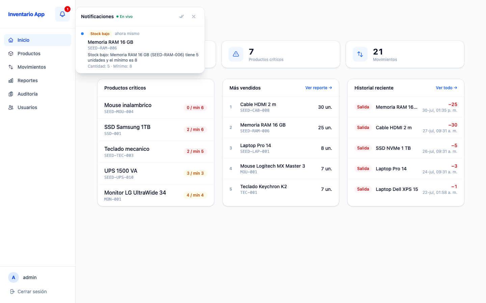

# Anexo D — Interfaz de usuario

Capturas **generadas** por Playwright recorriendo la aplicación real como administrador, con
los datos de demostración sembrados por Flyway. No se editan a mano.

```bash
docker compose up -d
npx playwright test -c playwright.capturas.config.ts
```

Conviene tomarlas sobre un entorno recién sembrado: las suites de carga y de extremo a
extremo dejan sus propios productos, que ensucian las pantallas de listado y de reportes.

Cada pantalla indica el requisito del [SRS](01-requisitos.md) que evidencia.

---

## Acceso

Inicio de sesión delegado en Keycloak: la aplicación nunca ve la contraseña. — **RF-01, RF-02**



## Tablero

Indicadores del inventario, productos críticos, más vendidos e historial reciente. Cada widget
se muestra solo si el usuario tiene el permiso correspondiente. — **RF-65, RF-14**


## Productos

Listado paginado con búsqueda por nombre o SKU, filtro por estado y acciones por fila. Las
acciones de gestión solo aparecen para quien tiene `product:manage`. — **RF-24, RF-27, RF-14**



### Alta y edición

Formulario con validación en el borde: nombre, SKU, categoría, precio, cantidad, stock mínimo
y estado. — **RF-20, RF-25**



### Registro de movimiento

Entrada, salida o ajuste sobre un producto. Una salida mayor al stock disponible se rechaza
sin modificar nada. — **RF-30, RF-32**



## Movimientos

Historial paginado con filtros por tipo y por producto, mostrando cantidad anterior y nueva,
usuario y fecha. — **RF-34, RF-37**



## Reportes

Resumen del inventario, productos más movidos por salida, stock bajo y movimientos agrupados
por tipo con rango de fechas. — **RF-60, RF-61, RF-62, RF-63**



## Auditoría

Historial de revisiones de productos con número de revisión, fecha, usuario y tipo de cambio.
— **RF-70, RF-71, RF-73**



## Usuarios y roles

Administración de los roles de cada usuario del realm. Los permisos heredados de un rol
compuesto se muestran como no removibles. — **RF-80, RF-83, RF-84**



## Alertas de stock

Panel en vivo alimentado por WebSocket: la alerta aparece sin recargar la página en cuanto un
producto cruza su stock mínimo. — **RF-40, RF-45, RF-47, RF-48**


